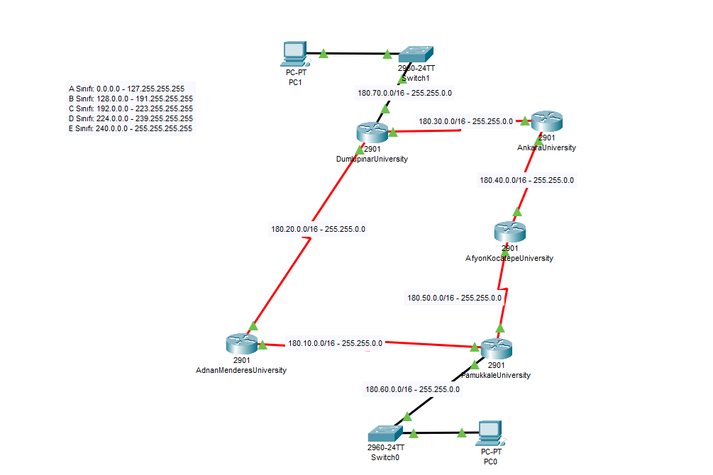

# University Network Topology Simulation

Bu depo, Cisco Packet Tracer kullanılarak oluşturulmuş üniversiteler arası bir ağ topolojisi simülasyonunu içermektedir.

## 📌 Proje Detayları

- **Router Sayısı:** 5 (Her biri bir üniversiteyi temsil ediyor)
- **LAN Sayısı:** 2 (PC bağlantıları için)
- **Routing Protokolü:** OSPF
- **IP Sınıfı:** Class B (Subnet Mask: 255.255.0.0)
- **Router İsimleri:**
  - Adnan Menderes University
  - Dumlupinar University
  - Ankara University
  - Afyon Kocatepe University
  - Pamukkale University

## 🖥 Topoloji Görünümü

## 📂 Dosyalar

- `21253506.pkt` → Cisco Packet Tracer dosyası
- `ekran_goruntusu.png` → Ağ topolojisinin ekran görüntüsü

## 💡 Açmak İçin

1. [Cisco Packet Tracer](https://www.netacad.com/courses/packet-tracer) programını indirip kurun.
2. `21253506.pkt` dosyasını açarak topolojiyi görüntüleyin.
3. OSPF routing yapılandırmasını ve bağlantıları inceleyin.

## ✅ Hazırlayan

- **İsim:** Emir Kıvrak
- **Üniversite:** Pamukkale University
